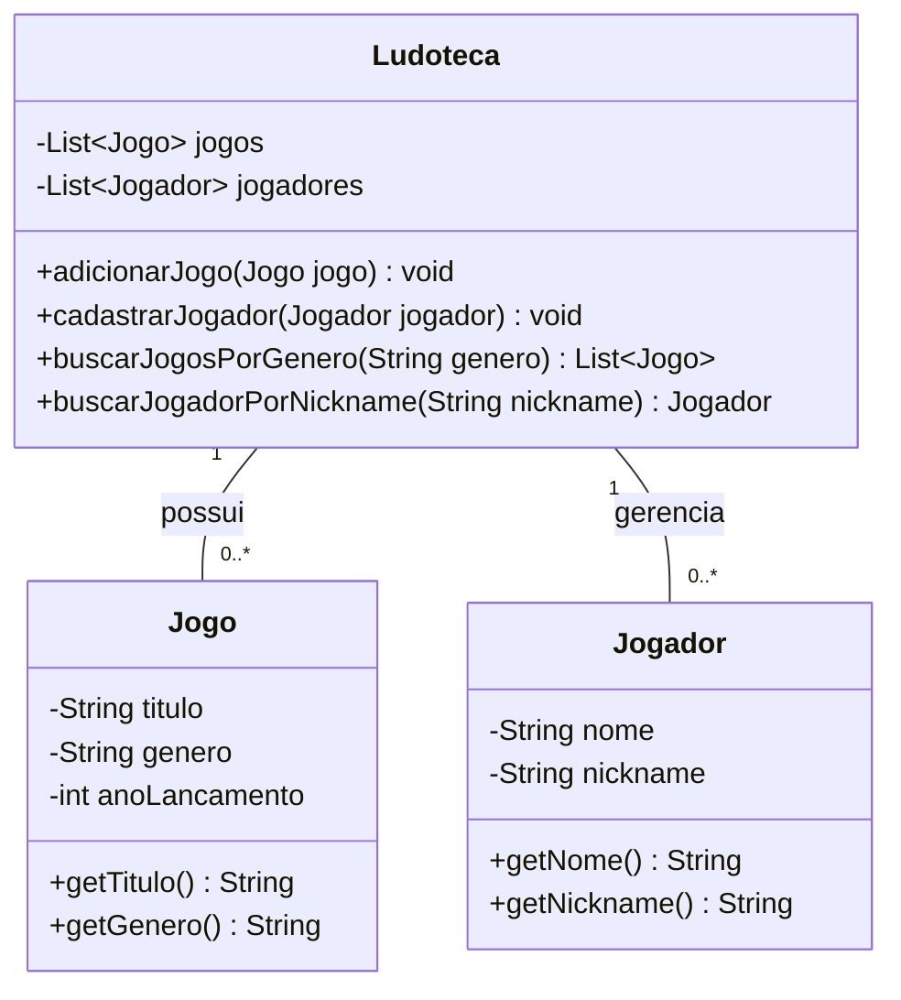

## ATIVIDADES 4, 5 E 6: Código Java e Testes

A implementação do diagrama UML da Ludoteca (com as 3 classes) e seus testes automatizados utilizando JUnit estão disponíveis na pasta abaixo.

---
## Atividade 4 (UML):

