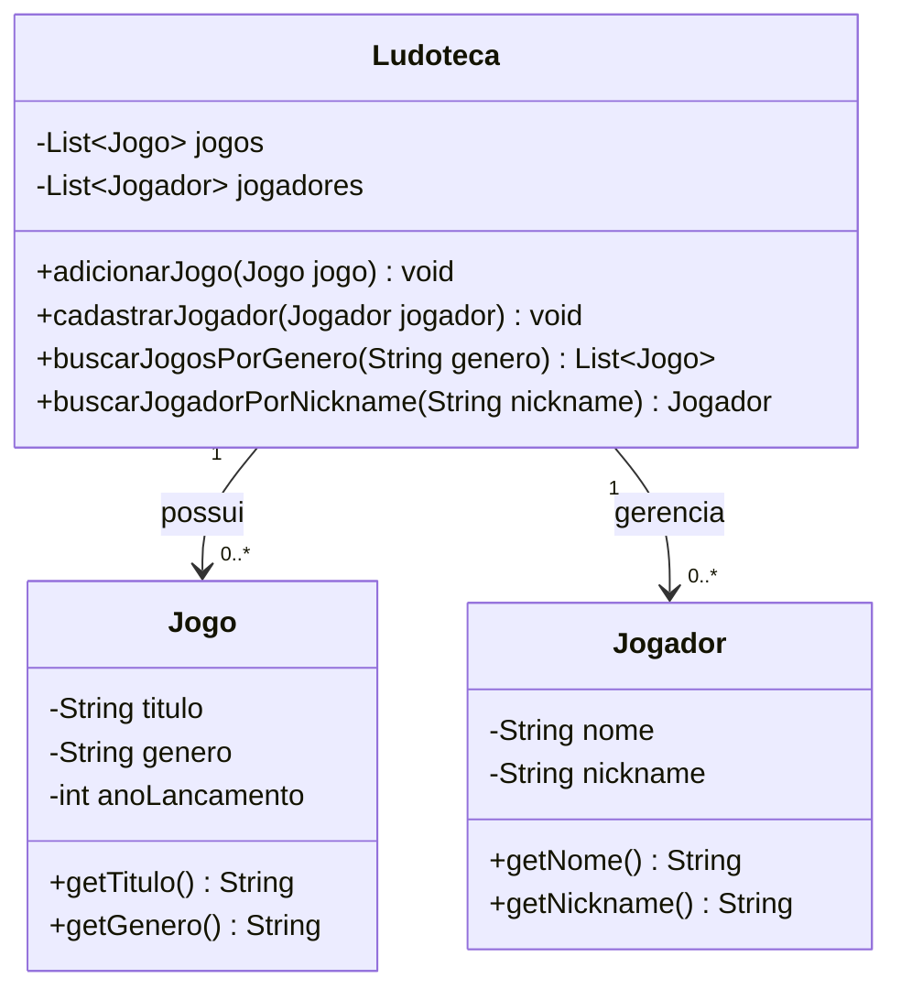

# Atividade de Engenharia de Software

Este repositório contém as atividades desenvolvidas para a disciplina de Engenharia de Software, com base nos estudos do livro "Software Engineering at Google".

## 1. Comentário sobre o primeiro trecho

O primeiro texto aborda a diferença fundamental entre "programação" e "engenharia de software". Muitas vezes usamos os termos como sinônimos, mas eles têm focos diferentes.

* **Programar** é, essencialmente, o ato de escrever código para instruir um computador a realizar uma tarefa. É a atividade central, o "como fazer".
* **Engenharia de Software**, por outro lado, é uma disciplina muito mais ampla. Ela aplica princípios de engenharia para construir sistemas de software de forma organizada, confiável e, principalmente, sustentável. Ela não se preocupa apenas com o código que funciona hoje, mas também com a sua manutenção, precisão e como ele se comportará no mundo real, de forma parecida com outras engenharias, como a civil ou a aeronáutica, que precisam de rigor e planejamento para criar algo que seja seguro e duradouro.

Em resumo, programar é uma parte da engenharia de software, mas a engenharia envolve todo o ciclo de vida do software, desde o planejamento até a manutenção.

## 2. Comentário sobre o segundo trecho

O segundo trecho define a engenharia de software de uma forma muito prática: **"programação integrada ao longo do tempo"**. Essa ideia deixa claro que o trabalho de um engenheiro de software não termina quando o código é entregue. Ele precisa considerar o futuro do software, e para isso, o livro destaca três princípios fundamentais:

1.  **Tempo e Mudança:** O código precisa ser adaptável. Ao longo de sua vida útil, ele precisará de atualizações, correções e novas funcionalidades. A engenharia de software busca criar um código que facilite essas mudanças no futuro.
2.  **Escala e Crescimento:** Um sistema precisa ser capaz de crescer. Isso significa que ele deve continuar funcionando de forma eficiente mesmo que o número de usuários, a quantidade de dados ou a complexidade aumentem drasticamente.
3.  **Trade-offs e Custos:** Não existe solução perfeita. Em engenharia de software, estamos constantemente fazendo escolhas. Um "trade-off" é uma decisão onde ganhamos algo, mas abrimos mão de outra coisa. É essencial entender os custos e benefícios de cada escolha para o projeto.

## 3. Três exemplos de Trade-offs

Trade-offs são decisões de troca, onde uma escolha é priorizada em detrimento de outra para atender a um requisito mais importante no projeto. Abaixo estão três exemplos práticos:

### a) Escalabilidade vs. Simplicidade

* **Cenário:** Precisamos desenvolver uma nova aplicação. Podemos escolher uma arquitetura monolítica (todo o código em um único bloco), que é mais **simples** de desenvolver e implantar inicialmente. Ou podemos optar por uma arquitetura de microsserviços, que é mais complexa, mas oferece maior **escalabilidade** para suportar milhões de usuários no futuro.
* **O Trade-off:** A escolha é entre a simplicidade e a velocidade de desenvolvimento agora (monolítico) contra a capacidade de crescer e escalar de forma mais fácil no futuro (microsserviços).

### b) Portabilidade vs. Desempenho

* **Cenário:** Estamos desenvolvendo um software que precisa rodar em vários sistemas operacionais (Windows, macOS, Linux). Uma linguagem como Java é excelente para isso, pois é altamente **portátil** (escreva uma vez, rode em qualquer lugar). No entanto, para uma tarefa que exige o máximo de velocidade, uma linguagem como C++ ou Assembly, compilada especificamente para uma máquina, teria um **desempenho** muito superior.
* **O Trade-off:** A escolha é entre a flexibilidade de ter um código que funciona em múltiplas plataformas (portabilidade) contra a obtenção da máxima velocidade e eficiência em uma plataforma específica (desempenho).

### c) Banco de Dados SQL vs. NoSQL

* **Cenário:** Precisamos armazenar os dados de uma aplicação. Um banco de dados **SQL** (como MySQL) oferece uma estrutura rígida, com tabelas e relacionamentos bem definidos, garantindo alta consistência dos dados. Um banco de dados **NoSQL** (como MongoDB) é mais flexível, não exige um esquema fixo e escala horizontalmente com mais facilidade.
* **O Trade-off:** A escolha é entre a consistência e a estrutura garantida de um banco SQL contra a flexibilidade e a escalabilidade de um banco NoSQL, que é ideal para dados não estruturados ou que mudam com frequência.

---

## ATIVIDADE 4: Diagrama de Classes UML

Para esta atividade, foi desenvolvido um diagrama de classes original com o tema de jogos. A estrutura representa uma `Ludoteca` (biblioteca de jogos), que gerencia um catálogo de `Jogo` e um cadastro de `Jogador`.

---

## ATIVIDADES 5 E 6: Código Java e Testes

A implementação do diagrama UML da Ludoteca (com as 3 classes) e seus testes automatizados utilizando JUnit estão disponíveis na pasta abaixo.

**Pasta:** [ludoteca-exemplo-projeto](./ludoteca-projeto)

---

## ATIVIDADE 7: Projeto Biblioteca com Banco de Dados SQLite

A utilização do código feito em sala com o professor com as ações de guardar e buscar o objeto livro.

**Pasta do Projeto:** [biblioteca-sqlite](./biblioteca-sqlite)
